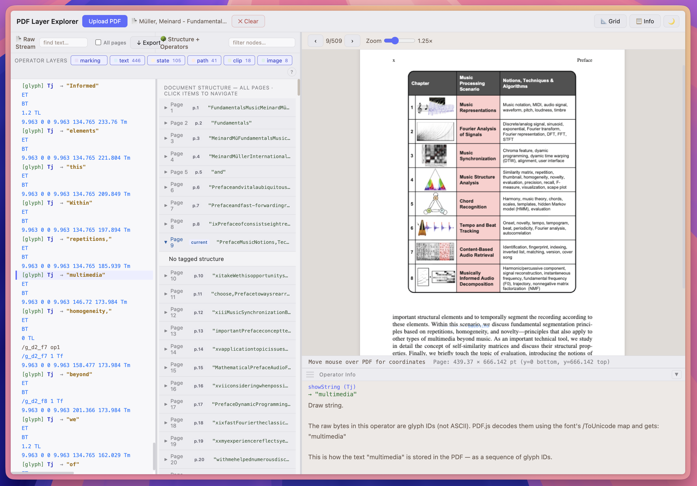

# 📄 PDF Layer Explorer

**PDF Layer Explorer** is a powerful, web-based tool designed to deconstruct and inspect the internal "DNA" of PDF documents. Whether you are a developer debugging PDF generation, a designer curious about document structure, or just curious about how PDFs are built, this tool provides a visual interface for exploring content streams, operators, and logical structures.

### 🚀 [Try the Live Demo](https://ingridstevens.github.io/pdf-explorer/)

---

## ✨ Key Features

### 🔍 Deep Content Inspection
* **Structure Tree**: Navigate the logical hierarchy of your PDF, including Tags, MCIDs (Marked Content IDs), and nested elements.
* **Operator Stream**: Browse the raw drawing commands (operators like `BT`, `Tj`, `m`, `l`, `S`) used to render each page.
* **Syntax-Highlighted Raw View**: View the page's content stream in a code-friendly format with clear distinction between operators, strings, numbers, and comments.

### 🎨 Visual & Interactive Explorer
* **Click-to-Inspect**: Click any element on the PDF canvas to instantly jump to its corresponding drawing operator or structural node.
* **Visual Highlighting**: Selecting an operator in the list automatically highlights its visual representation on the document.
* **Coordinate Tracking**: Your real-time coordinate strip displays precise X/Y positions and page dimensions as you move your cursor.
* **Layer Management**: Toggle the visibility of different PDF layers (Optional Content Groups) to isolate specific components.

### 🛠 Productivity Tools
* **Global Search**: Search through operators and structural nodes across the current page or the entire document.
* **Flexible UI**: Features a fully resizable layout, adjustable side panels, and a collapsible info box for a customized workspace.
* **Dark & Light Modes**: Full theme support for comfortable viewing in any environment.
* **No Upload Required**: Processes files locally in your browser—your data never leaves your machine.

---

## 🛠 Technology Stack
* **Frontend**: Vanilla JavaScript, HTML5, and CSS3.
* **Rendering**: High-performance PDF rendering engine (PDF.js) for accurate visual representation.
* **Styling**: Custom CSS properties for dynamic theme switching and a modern, responsive interface.

---

## 📖 How to Use

1.  **Open the App**: Visit the [live link](https://ingridstevens.github.io/pdf-explorer/).
2.  **Load a PDF**: Drag and drop a PDF file onto the canvas or use the file picker.
3.  **Explore the Tree**: Use the **Left Panel** to browse the **Structure** or **Operators** tabs.
4.  **Interact with the Canvas**: Hover over elements to see coordinates, or click them to reveal their underlying drawing commands.
5.  **Toggle Layers**: If your PDF has layers, use the **Layers Bar** to show/hide specific content.

---

## 🤝 Contributing
Contributions are welcome! If you have ideas for new features or find a bug, please feel free to open an issue or submit a pull request.

---

## 📄 License
This project is licensed under the MIT License.

---

*Developed by [Ingrid Stevens](https://github.com/ingridstevens)*
